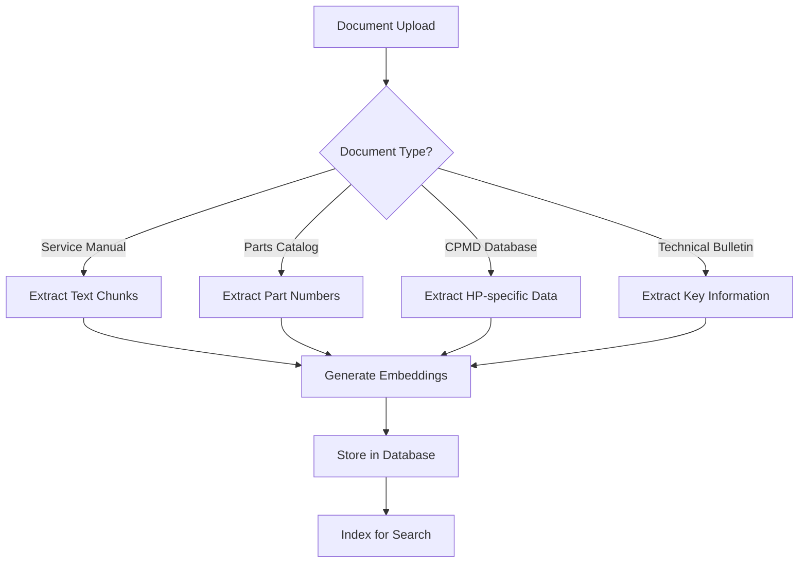

# 📚 KRAI ENGINE - DOCUMENT TYPES GUIDE

**Comprehensive Guide to Supported Document Types**

---

## 🎯 **SUPPORTED DOCUMENT TYPES**

### **📋 Universal Document Types (All Manufacturers)**

#### **📖 Service Manuals**
- **Description**: Primary repair and maintenance documentation
- **Content**: Step-by-step repair procedures, disassembly guides, calibration instructions
- **Manufacturers**: HP, Canon, Epson, Brother, Xerox, etc.
- **Example**: "HP LaserJet Pro 4000 Series Service Manual"

#### **🔧 Parts Catalogs**
- **Description**: Spare parts and component identification
- **Content**: Part numbers, diagrams, replacement procedures, compatibility matrices
- **Manufacturers**: All major printer manufacturers
- **Example**: "Canon imageRUNNER 4000i Parts Catalog"

#### **📢 Technical Bulletins**
- **Description**: Technical updates, service notices, and field modifications
- **Content**: Service bulletins, firmware updates, known issues, solutions
- **Manufacturers**: All manufacturers (varies by naming convention)
- **Example**: "Epson Technical Bulletin TB-2024-001"

#### **👤 User Manuals**
- **Description**: End-user operation and basic maintenance
- **Content**: Setup instructions, operation procedures, basic troubleshooting
- **Manufacturers**: All manufacturers
- **Example**: "Brother MFC-L2750DW User Manual"

#### **⚙️ Installation Guides**
- **Description**: Initial setup and installation procedures
- **Content**: Network configuration, driver installation, initial setup
- **Manufacturers**: All manufacturers
- **Example**: "Xerox WorkCentre 6515 Installation Guide"

---

### **🏭 HP-Specific Document Types**

#### **📘 CPMD Database (HP Only)**
- **Description**: Companion documents to Service Manuals (HP-specific)
- **Content**: Parts information, error codes, diagnostic procedures
- **Manufacturers**: HP only
- **Example**: "HP LaserJet Pro 4000 CPMD Database"
- **Note**: CPMD = Customer Parts and Maintenance Data

#### **🔍 Troubleshooting Guides**
- **Description**: HP-specific diagnostic and troubleshooting procedures
- **Content**: Error resolution, diagnostic tests, maintenance schedules
- **Manufacturers**: Primarily HP (some other manufacturers have similar)
- **Example**: "HP LaserJet Pro 4000 Troubleshooting Guide"

#### **💻 Software Documentation**
- **Description**: HP software and utility documentation
- **Content**: HP Smart, HP Easy Start, diagnostic utilities
- **Manufacturers**: HP only
- **Example**: "HP Smart App Documentation"

---

## 🗄️ **DATABASE IMPLEMENTATION**

### **Document Type Constraints**
```sql
-- Implemented in krai_core.documents table
document_type text CHECK (document_type IN (
    'service_manual',        -- Standard repair manuals
    'parts_catalog',         -- Spare parts catalogs
    'technical_bulletin',    -- Technical bulletins/notices
    'user_manual',           -- End-user manuals
    'installation_guide',    -- Setup and installation
    'cpmd_database',         -- HP-specific CPMD (HP only)
    'troubleshooting_guide', -- Diagnostic procedures
    'software_documentation' -- Software and utilities
))
```

### **Manufacturer-Specific Filtering**
```sql
-- Example query for HP-specific documents
SELECT * FROM krai_core.documents 
WHERE manufacturer_id = 'HP_MANUFACTURER_ID'
AND document_type IN ('service_manual', 'cpmd_database', 'troubleshooting_guide');

-- Example query for universal documents
SELECT * FROM krai_core.documents 
WHERE document_type IN ('service_manual', 'parts_catalog', 'technical_bulletin');
```

---

## 🔍 **SEARCH & RETRIEVAL**

### **Document Type Filtering in Search**
```python
# Python example for document type filtering
def search_documents(query, document_types=None, manufacturer_id=None):
    """
    Search documents with optional filtering by type and manufacturer
    """
    search_params = {
        'query': query,
        'document_type_filter': document_types,  # ['service_manual', 'parts_catalog']
        'manufacturer_filter': manufacturer_id
    }
    
    result = supabase.rpc('optimized_comprehensive_search', search_params).execute()
    return result.data
```

### **HP-Specific Document Retrieval**
```python
# Get HP documentation set for a specific model
def get_hp_documentation_set(model_id):
    """
    Retrieve complete HP documentation set (Service Manual + CPMD + Troubleshooting)
    """
    result = supabase.rpc('get_hp_documentation_set', {
        'model_id': model_id
    }).execute()
    
    return {
        'service_manual': result.data[0]['service_manual_name'],
        'cpmd_database': result.data[0]['cpmd_file_name'],
        'troubleshooting': result.data[0]['troubleshooting_guide']
    }
```

---

## 📊 **DOCUMENT PROCESSING PIPELINE**

### **Document Ingestion Workflow**


### **Processing Priorities**
1. **Service Manuals** - Highest priority (core repair documentation)
2. **CPMD Databases** - High priority (HP-specific companion data)
3. **Parts Catalogs** - High priority (essential for repairs)
4. **Technical Bulletins** - Medium priority (updates and notices)
5. **User Manuals** - Low priority (end-user focused)
6. **Installation Guides** - Low priority (setup only)

---

## 🚀 **SCALABILITY FEATURES**

### **Easy Extension for New Document Types**
```sql
-- Adding new document types is simple
ALTER TABLE krai_core.documents 
DROP CONSTRAINT documents_document_type_check;

ALTER TABLE krai_core.documents 
ADD CONSTRAINT documents_document_type_check 
CHECK (document_type IN (
    'service_manual',
    'parts_catalog', 
    'technical_bulletin',
    'user_manual',
    'installation_guide',
    'cpmd_database',
    'troubleshooting_guide',
    'software_documentation',
    'firmware_documentation',    -- New type
    'training_materials',        -- New type
    'compliance_documents'       -- New type
));
```

### **Manufacturer-Specific Extensions**
```sql
-- Example: Adding Canon-specific document types
-- Canon uses different naming conventions
'canon_service_bulletin',    -- Canon's version of technical bulletins
'canon_parts_manual',        -- Canon's version of parts catalogs
'canon_field_guide'          -- Canon's version of troubleshooting guides
```

---

## ✅ **BENEFITS OF CURRENT STRUCTURE**

### **✅ Scalability**
- **Easy to add new document types** without schema changes
- **Manufacturer-specific types** can be added as needed
- **Flexible categorization** supports all current and future document types

### **✅ Search Optimization**
- **Document type filtering** improves search relevance
- **Manufacturer-specific searches** for targeted results
- **Cross-document relationships** link related documents

### **✅ Processing Efficiency**
- **Type-specific processing** for optimal content extraction
- **Priority-based processing** for important documents first
- **Flexible metadata** for document-specific attributes

---

## 🎯 **RECOMMENDATIONS**

### **For Document Upload:**
1. **Always specify document_type** during upload
2. **Use manufacturer-specific types** when available (e.g., CPMD for HP)
3. **Link related documents** using document_relationships
4. **Set processing priorities** based on document importance

### **For Search Implementation:**
1. **Filter by document_type** for better relevance
2. **Use manufacturer-specific functions** for HP documents
3. **Combine multiple document types** for comprehensive results
4. **Prioritize service_manual and parts_catalog** in search results

---

**📚 The current document structure is fully scalable and ready for all document types across all manufacturers!**
